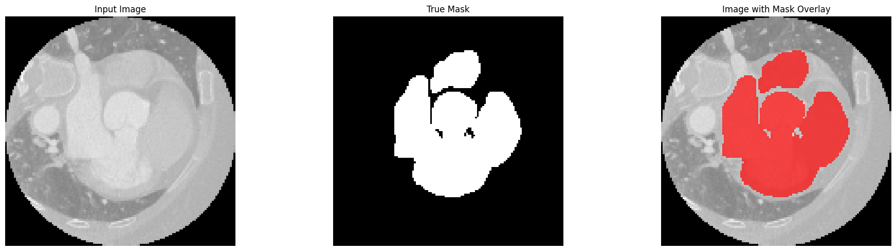
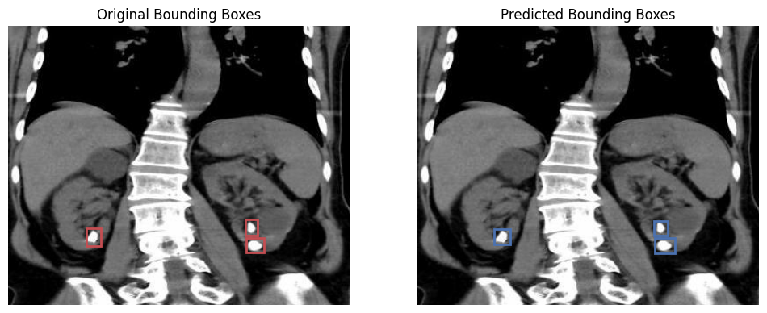
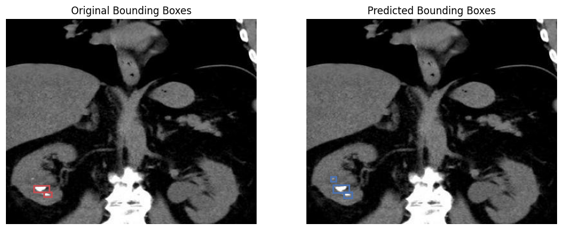

# 🖼️ Medical Image Analysis Repository

Welcome to the Medical Image Analysis Repository! Here, we leverage advanced machine learning and deep learning techniques to analyze medical images and derive valuable insights. 🌟

## 💓 [Whole Heart Segmentation from CT and MRI Scans](./mm-whs-seg-keras.ipynb) 

- **Overview**: 🩺 Segmentation of the whole heart from CT and MRI scans.
- **Dataset**: 📊 20 patients, total of 5305 CT scans.
- **Performance Metrics 📈**: 
  - **Accuracy**: 75.63%
  - **IoU**: 51.23% (Max 88.68%)
  - **Dice Coefficient**: 65.5% (Max 93.82%)
- **Key Insights**: 🔍
  - The current dataset of 20 patients is insufficient for building a reliable model.
  - It's more effective to treat the scans as full 3D samples per patient instead of operating on a 2D slide-by-slide basis. This approach leads to unstable performance with the current dataset size.
- **Techniques Used**: 
  - 🛠️ Data Preprocessing: Normalization and Augmentation
  - 🧠 Model Architecture: U-Net with Batch Normalization and Dropout
  - 🧮 Evaluation Metrics: Accuracy, IoU, and Dice Coefficient
- **Drawbacks**: ⚠️
  - Limited dataset size: 20 patients aren't enough for stable and reliable model performance.

- **References**: 📚
  - [1] S Gao, H Zhou, Y Gao, X Zhuang. BayeSeg: Bayesian Modeling for Medical Image Segmentation with Interpretable Generalizability. Medical Image Analysis 89, 102889, 2023 code&tutorial, link (Elsevier-MedIA 1st Prize & Best Paper Award of MICCAI society 2023)
  - [2] Xiahai Zhuang: Multivariate mixture model for myocardial segmentation combining multi-source images. IEEE Transactions on Pattern Analysis and Machine Intelligence 41(12): 2933-2946, 2019. link code
  - [3] X Luo & X Zhuang: X-Metric: An N-Dimensional Information-Theoretic Framework for Groupwise Registration and Deep Combined Computing. IEEE Transactions on Pattern Analysis and Machine Intelligence 45(7): 9206 - 9224, 2023 (IF: 24.314) link code
  - [4] F Wu & X Zhuang. Minimizing Estimated Risks on Unlabeled Data: A New Formulation for Semi-Supervised Medical Image Segmentation. IEEE Transactions on Pattern Analysis and Machine Intelligence (T PAMI) 45(5): 6021 - 6036, 2023 link code

## 🟢 [Kidney Stone Object Detection](./kidney-stone-detection.ipynb)

- **Overview**: 🩺 Detection of kidney stones in abdominal CT scans using YOLOv8.
  - Our model tends to outperform the original annotation in some cases, as can be seen in the sample image above where it detected a seemingly newly developing stone.

- **Dataset**: 📊 Over 1000 images of abdominal section scans showing the kidneys.
- **Performance Metrics 🎯**:
  - **Precision**: 0.772
  - **Recall**: 0.711
  - **mAP@50**: 0.74

- **Key Insights**: 🔍
  - The model effectively detects kidney stones with a balanced precision and recall.
  - Fine-tuning the YOLOv8 parameters significantly improved detection performance.

- **Techniques Used**:
  - 🛠️ Data Preprocessing: Image normalization and augmentation in YOLO.
  - 🧠 Model Architecture: YOLOv8 for efficient object detection.
  - 🧮 Evaluation Metrics: Precision, Recall, and mAP@50.

- **Challenges**:
  - Variability in image quality and stone size posed challenges in detection accuracy.
  - The need for a larger and more diverse dataset to further improve model robustness.

- **References**: 📚
  - - **Dataset**: TEZ_ROI_AUG. (2023, April 28). Retrieved from [https://universe.roboflow.com/tez-nwkf5/tez_roi_aug](https://universe.roboflow.com/tez-nwkf5/tez_roi_aug). Provided by a Roboflow user. License: CC BY 4.0.
